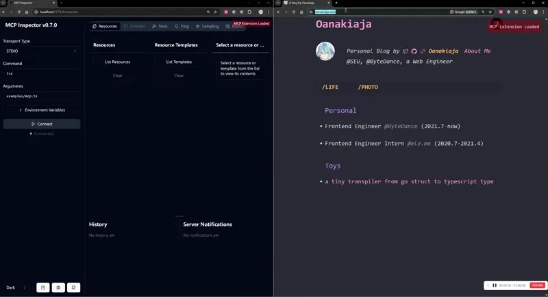

# Chrome Extension Socket MCP

A Chrome extension that establishes a WebSocket connection between web pages and a local MCP server. This allows you to interact with web page resources and execute functions from your mcp server.

Inspired by [playcanvas/editor-mcp-server](https://github.com/playcanvas/editor-mcp-server).

## Overview

This project consists of two main components:

1. **Chrome Extension**: Injects a client script into web pages that establishes a WebSocket connection to your local server.
2. **Local MCP Server**: A WebSocket server that can send commands to the extension and receive responses.

With this setup, you can:
- Access browser APIs and DOM elements from your local server
- Execute JavaScript functions in the context of web pages
- Retrieve resources and information from web pages
- Especially, access the global object like editor, e.x : [https://threejs.org/editor/](https://threejs.org/editor/). You can use `window.editor` which is exposed by the website to control the editor. Just like [playcanvas/editor-mcp-server](https://github.com/playcanvas/editor-mcp-server).

## Installation

### Setup

1. Clone the repository:
```bash
git clone https://github.com/yourusername/chrome-extension-socket-mcp.git
cd chrome-extension-socket-mcp
```

2. Install dependencies:
```bash
npm install
```

## Development

Run the following command to build the extension in development mode:

```bash
npm run debug
```

### Loading the Extension

1. Open Chrome and navigate to `chrome://extensions/`
2. Enable "Developer mode" by toggling the switch in the top right corner
3. Click "Load unpacked" and select the `extension` folder from this project
4. The extension is now installed. You should see a small red indicator in the top right corner of any web page indicating "MCP Extension Loaded"

## Usage

### Server-side

```typescript
import { McpServer } from "@modelcontextprotocol/sdk/server/mcp.js";
import { StdioServerTransport } from "@modelcontextprotocol/sdk/server/stdio.js";
import { z } from "zod"; 
import { Client } from "../src/client";

// Define the port for WebSocket connection
// This should match the port in your Chrome extension's WebSocket connection
const port = 54319;
const client = new Client(port);

// Establish connection to the Chrome extension
await client.connect();

// Create a new MCP server instance with name and version
const server = new McpServer({
  name: "Extension-Socket-Server",
  version: "1.0.0",
});

// Register a tool that executes the window.alert function in the browser
// This demonstrates how to interact with browser APIs from your server
server.tool(
  "alert",                  // Tool name
  "use window.alert",       // Tool description
  { message: z.string() },  // Tool parameters schema using Zod
  async ({ message }) => {  // Tool implementation function
    // Call the extension to execute alert in the browser context
    const response = await client.callToolExtension("alert", { message });
    return response;
  }
);

// Register a resource to retrieve the browser's user agent
// This demonstrates how to access browser properties from your server
server.resource(
  "userAgent",              // Resource name
  "useragent://chrome",     // Resource URI template
  async (uri) => {          // Resource handler function
    // Get the user agent from the browser
    const { content } = await client.callResourceExtension("navigator.userAgent");
    // Return the formatted resource
    return {
      contents: [
        {
          uri: uri.href,
          text: content[0].text,
        },
      ],
    };
  }
);

// Set up a transport layer for the MCP server
// StdioServerTransport uses standard input/output for communication
const transport = new StdioServerTransport();
await server.connect(transport);

// Handle application termination gracefully
process.on("SIGINT", async () => {
  console.log("SIGINT signal received");  // Log when SIGINT is received
  await client.dispose();                 // Close the WebSocket connection
  process.exit(0);                        // Exit the process
});
```

### Extension-side

The extension automatically connects to `ws://localhost:54319` by default. You can modify this in `extension/content.js`.

The extension exposes two main entry points for server commands:

- `mcp:resource.*` - For accessing browser resources and properties
- `mcp:tool.*` - For executing functions in the browser context

## API Reference

### Client

- `new Client(port)` - Create a new client instance connecting to specified port
- `connect()` - Connect to the MCP server
- `callToolExtension(toolName, params)` - Call a tool in the browser
- `callResourceExtension(resourceName, params)` - Get a resource from the browser
- `dispose()` - Close the connection

### WebSocket Protocol

The extension uses a simple JSON-RPC-like protocol:

**Request**:
```json
{
  "id": "unique-request-id",
  "method": "mcp:resource.navigator.userAgent",
  "params": {}
}
```

**Response**:
```json
{
  "id": "unique-request-id",
  "result": "Mozilla/5.0 ..."
}
```

## Examples



## License

[MIT](LICENSE)
